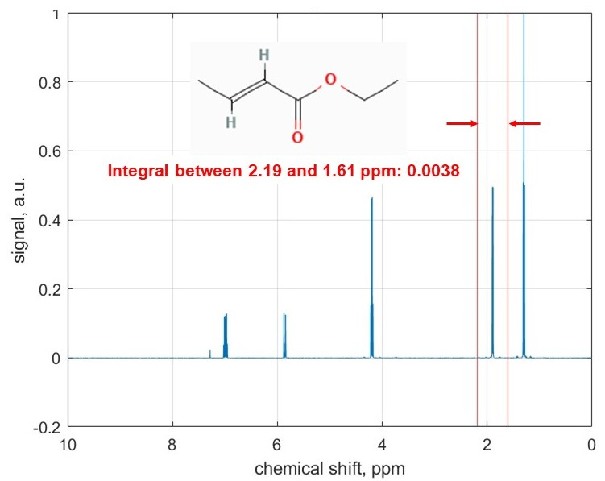

## 4. NMR Signal Integration   

Area under each NMR signal is proportional to the number of nuclei contributing to that signal. Therefore, signal integration allows for quantitative analysis of mixtures. For example, in a molecule like ethanol, integration can reveal hydrogen atom counts in different functional groups (CH3, CH2, OH). 
In this interactive example, we select areas of interest on a sample NMR spectrum of ethyl crotonate and use trapezium rule for the numerical integration, as illustrated in the above figure. This NMR data is kindly provided by Prof. Ilya Kuprov, University of Southampton. The presented approach finds the corresponding array index extents which allows automated quantification to handle large number of spectra databases. 

### Usage

This code can be opened in [MATLAB® Online™](https://matlab.mathworks.com/).

